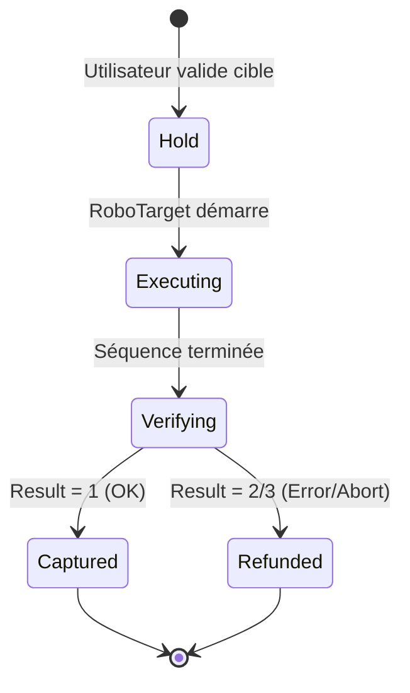

# 💳 Système de Crédits v2 - Abonnements & RoboTarget

> **Version:** 2.0.0
> **Date:** 12 Décembre 2025
> **Modèle:** Abonnements mensuels + Crédits à la consommation

---

## 📋 Table des matières

1. [Vue d'ensemble](#vue-densemble)
2. [Les 3 abonnements](#les-3-abonnements)
3. [Système de crédits](#système-de-crédits)
4. [Pricing Engine](#pricing-engine)
5. [Cycle de vie des transactions](#cycle-de-vie-des-transactions)
6. [Intégration Stripe](#intégration-stripe)
7. [Implémentation technique](#implémentation-technique)
8. [API](#api)

---

## Vue d'ensemble

### Changement de modèle

#### ❌ Ancien modèle (v1)
```
Utilisateur → Achète package de crédits → Utilise pour réservations horaires
```

**Problèmes :**
- Pas de récurrence
- Gestion complexe des packages
- Pas de segmentation utilisateurs

#### ✅ Nouveau modèle (v2)
```
Utilisateur → S'abonne (mensuel) → Reçoit crédits → Configure cibles RoboTarget
```

**Avantages :**
- 💰 **Revenus récurrents** (MRR)
- 🎯 **Segmentation claire** (Débutant/Amateur/Expert)
- 🔒 **Restrictions par palier** (gamification)
- 💎 **Upsell naturel** (déblocage de fonctionnalités)
- 📊 **Prévisibilité** (crédits mensuels fixes)

### Philosophie

Le système est conçu pour être **"Freemium-to-Premium"** :

1. **Stardust (29€)** : Point d'entrée accessible
2. **Nebula (59€)** : Montée en gamme avec options
3. **Quasar (119€)** : Expérience premium complète

---

## Les 3 abonnements

### 🌟 STARDUST - Débutant Éco (29€/mois)

```json
{
  "name": "Stardust",
  "price": 2900,
  "credits": 20,
  "target": "Débutants / Budget limité",
  "tagline": "Découvrez l'astrophotographie sans engagement"
}
```

#### Caractéristiques

| Feature | Valeur | Restriction |
|---------|--------|-------------|
| **Crédits mensuels** | 20 | - |
| **Coût par crédit** | 1.45€ | (implied) |
| **Priority** | 0-1 (Very Low / Low) | 🔒 Forcée |
| **Nuit noire** | ❌ Non disponible | 🔒 Lune acceptée |
| **Garantie HFD** | ❌ Non disponible | 🔒 Pas de garantie netteté |
| **Mode** | One-shot uniquement | 🔒 IsRepeat = false |
| **Dashboard temps réel** | ❌ Non | 🔒 |
| **Support** | Email (48h) | - |

#### Correspondance API Voyager

```json
{
  "Priority": 0,              // Forcé à 0 ou 1 (Very Low/Low)
  "C_MoonDown": false,        // Toujours false (lune OK)
  "C_HFDMeanLimit": 0,        // Pas de garantie netteté
  "IsRepeat": false,          // Pas de multi-nuits
  "C_Mask": "B"               // Altitude min uniquement
}
```

#### Use case

> "Je veux essayer l'astrophotographie distante sans dépenser trop. Je ne suis pas exigeant sur les conditions et j'accepte que la lune soit présente."

**Cibles typiques :**
- Objets brillants (M31, M42, M45)
- Tests d'équipement
- Découverte

---

### 🌌 NEBULA - Amateur Confirmé (59€/mois)

```json
{
  "name": "Nebula",
  "price": 5900,
  "credits": 60,
  "target": "Amateurs confirmés",
  "tagline": "Options avancées et conditions optimales"
}
```

#### Caractéristiques

| Feature | Valeur | Note |
|---------|--------|------|
| **Crédits mensuels** | 60 | - |
| **Coût par crédit** | 0.98€ | (implied) |
| **Priority** | ≤ 2 (Normal) | ✅ Débloqué |
| **Nuit noire** | ✅ Option | ⚠️ x2 crédits si activée |
| **Garantie HFD** | Standard (4.0px) | ✅ Fixe, pas remboursement |
| **Dashboard temps réel** | ✅ Oui | Via RemoteSetDashboardMode |
| **Mode** | One-shot + Repeat | ✅ Multi-nuits débloqué |
| **Support** | Email prioritaire (24h) | - |

#### Correspondance API Voyager

```json
{
  "Priority": 2,              // Normal (accès jusqu'à 2)
  "C_MoonDown": true,         // Option débloquée (checkbox)
  "C_HFDMeanLimit": 4.0,      // Netteté standard (fixe)
  "IsRepeat": true,           // Multi-nuits autorisé
  "C_Mask": "BK"              // Altitude + Moon down
}
```

#### Multiplicateurs

```javascript
// Exemple calcul
baseCost = 10 crédits
priority = 2 → x1.2
moonDown = true → x2.0

finalCost = 10 * 1.2 * 2.0 = 24 crédits
```

#### Use case

> "Je connais l'astrophotographie et je veux des images de qualité. Je suis prêt à payer plus pour éviter la lune et avoir un suivi en temps réel."

**Cibles typiques :**
- Nébuleuses (Ha, OIII, SII)
- Galaxies faibles
- Projets LRGB multi-nuits

---

### ⚡ QUASAR - Expert VIP (119€/mois)

```json
{
  "name": "Quasar",
  "price": 11900,
  "credits": 150,
  "target": "Experts / Astrophotographes confirmés",
  "tagline": "Priorité absolue et garanties de qualité"
}
```

#### Caractéristiques

| Feature | Valeur | Note |
|---------|--------|------|
| **Crédits mensuels** | 150 | - |
| **Coût par crédit** | 0.79€ | (implied) |
| **Priority** | 3-4 (High/First) | ✅ Coupe-file |
| **Nuit noire** | ✅ Toujours | Inclus |
| **Garantie HFD** | Ajustable (< 4.0px) | ✅ Curseur 1.5-4.0px |
| **Rejection floue** | ✅ Automatique | Images rejetées si HFD > limit |
| **Dashboard temps réel** | ✅ Oui | - |
| **Sets avancés** | ✅ Oui | RemoteRoboTargetAddSet |
| **Mosaïques** | ✅ Oui | Gestion multi-panels |
| **Support** | Chat prioritaire + Email | - |

#### Correspondance API Voyager

```json
{
  "Priority": 4,              // First (priorité absolue)
  "C_MoonDown": true,         // Toujours activé
  "C_HFDMeanLimit": 2.5,      // Curseur ajustable (utilisateur choisit)
  "IsRepeat": true,           // Multi-nuits
  "C_Mask": "ABCDEKO",        // Toutes contraintes disponibles
  "Sets": true                // Accès aux Sets
}
```

#### Garantie netteté (HFD)

```javascript
// Workflow Quasar
1. User configure HFD limit: 2.5px
2. RoboTarget capture image
3. Voyager mesure HFD: 3.2px
4. HFD > Limit → Image REJETÉE
5. RoboTarget retente automatiquement
6. Voyager mesure HFD: 2.1px ✅
7. Image ACCEPTÉE
```

**Interface utilisateur :**
```html
<label>
  Garantie netteté HFD
  <input
    type="range"
    min="1.5"
    max="4.0"
    step="0.1"
    value="2.5"
  />
  <span>< 2.5 pixels</span>
</label>
<p class="info">
  ⚠️ Activer cette option garantit que toutes les images
  auront un HFD inférieur à la valeur choisie.
  Images floues automatiquement rejetées et recapturées.
</p>
```

#### Use case

> "Je suis un astrophotographe sérieux. Je veux la priorité absolue, des nuits sans lune, et une garantie de netteté. Je travaille sur des projets complexes (mosaïques, bandes étroites)."

**Cibles typiques :**
- Projets mosaïques (IC1396, Cygnus Wall)
- Narrowband profond (Ha-OIII-SII)
- Galaxies ultra-faibles
- Projets compétition/publication

---

## Système de crédits

### Structure de base

```sql
-- Table users
ALTER TABLE users ADD COLUMN credits_balance INT DEFAULT 0;
ALTER TABLE users ADD COLUMN subscription_plan ENUM('stardust','nebula','quasar') NULL;
ALTER TABLE users ADD COLUMN subscription_status ENUM('active','cancelled','expired') DEFAULT 'active';
ALTER TABLE users ADD COLUMN subscription_period_start TIMESTAMP NULL;
ALTER TABLE users ADD COLUMN subscription_period_end TIMESTAMP NULL;
```

### Crédit vs Abonnement

#### Relation

```
1 Abonnement → X Crédits/mois
1 Crédit → 1 heure d'observation (base)
```

**Attention :** Le coût réel dépend des **multiplicateurs** !

#### Exemples

```javascript
// Stardust : 20 crédits
observation1 = {
  duration: 2h,
  priority: 0,
  moonDown: false
}
cost = 2h * 1.0 (priority) * 1.0 (no moon) = 2 crédits

// Nebula : 60 crédits
observation2 = {
  duration: 2h,
  priority: 2,
  moonDown: true
}
cost = 2h * 1.2 (priority) * 2.0 (moon) = 4.8 → 5 crédits

// Quasar : 150 crédits
observation3 = {
  duration: 2h,
  priority: 4,
  moonDown: true,
  hfdLimit: 2.5
}
cost = 2h * 3.0 (priority) * 2.0 (moon) * 1.5 (HFD) = 18 crédits
```

---

## Pricing Engine

### Architecture

```php
// app/Services/PricingEngine.php

class PricingEngine
{
    const BASE_COST_PER_HOUR = 1.0; // 1 crédit = 1 heure (base)

    public function calculateCost(
        Subscription $subscription,
        array $targetConfig
    ): int {
        // 1. Durée estimée
        $estimatedHours = $this->estimateDuration($targetConfig);

        // 2. Coût de base
        $baseCost = $estimatedHours * self::BASE_COST_PER_HOUR;

        // 3. Multiplicateurs
        $multiplier = $this->calculateMultiplier($subscription, $targetConfig);

        // 4. Coût final (arrondi supérieur)
        return (int) ceil($baseCost * $multiplier);
    }

    protected function calculateMultiplier(
        Subscription $subscription,
        array $config
    ): float {
        $multiplier = 1.0;

        // Priority
        $multiplier *= $this->getPriorityMultiplier($config['priority']);

        // Moon down
        if ($config['c_moon_down'] ?? false) {
            $multiplier *= 2.0;
        }

        // HFD guarantee
        if (($config['c_hfd_mean_limit'] ?? 0) > 0) {
            $multiplier *= 1.5;
        }

        return $multiplier;
    }

    protected function getPriorityMultiplier(int $priority): float
    {
        return match($priority) {
            0, 1 => 1.0,    // Very Low / Low
            2 => 1.2,       // Normal
            3 => 2.0,       // High
            4 => 3.0,       // First
            default => 1.0
        };
    }

    protected function estimateDuration(array $config): float
    {
        $totalSeconds = 0;

        foreach ($config['shots'] as $shot) {
            // Exposure * Quantity + overhead
            $exposureTime = $shot['exposure'] * $shot['quantity'];
            $overhead = $shot['quantity'] * 30; // 30s overhead par image
            $totalSeconds += $exposureTime + $overhead;
        }

        // Convertir en heures
        return $totalSeconds / 3600;
    }
}
```

### Tableau des multiplicateurs

| Critère | Valeur | Multiplicateur | Abonnement requis |
|---------|--------|----------------|-------------------|
| **Priority 0-1** | Very Low/Low | **x1.0** | Tous |
| **Priority 2** | Normal | **x1.2** | Nebula+ |
| **Priority 3** | High | **x2.0** | Quasar |
| **Priority 4** | First | **x3.0** | Quasar |
| **Moon Down** | Nuit noire | **x2.0** | Nebula+ |
| **HFD Guarantee** | Netteté garantie | **x1.5** | Quasar |

### Exemples de calculs

#### Exemple 1 : Stardust simple

```javascript
Configuration:
- Target: M42
- Filters: L (10x 60s)
- Priority: 0 (forcé)
- Moon: Acceptée (forcé)
- HFD: None (forcé)

Calcul:
baseCost = (10 * 60s + 10 * 30s) / 3600 = 0.25h = 0.25 crédits
multiplier = 1.0 (priority) * 1.0 (moon) * 1.0 (no HFD) = 1.0
finalCost = ceil(0.25 * 1.0) = 1 crédit

✅ 1 crédit utilisé sur 20
```

#### Exemple 2 : Nebula avec nuit noire

```javascript
Configuration:
- Target: NGC7000
- Filters: Ha (20x 300s), OIII (20x 300s)
- Priority: 2
- Moon: Nuit noire ✅
- HFD: 4.0px (standard)

Calcul:
baseCost = (40 * 300s + 40 * 30s) / 3600 = 3.67h = 3.67 crédits
multiplier = 1.2 (priority) * 2.0 (moon) * 1.0 (no custom HFD) = 2.4
finalCost = ceil(3.67 * 2.4) = 9 crédits

✅ 9 crédits utilisés sur 60
Reste: 51 crédits
```

#### Exemple 3 : Quasar complet

```javascript
Configuration:
- Target: IC1396 (Mosaic 2x2)
- Filters: Ha (40x 600s), OIII (40x 600s), SII (40x 600s)
- Priority: 4 (First)
- Moon: Nuit noire ✅ (inclus)
- HFD: < 2.0px ✅

Calcul:
baseCost = (120 * 600s + 120 * 30s) / 3600 = 21h = 21 crédits
multiplier = 3.0 (priority) * 2.0 (moon) * 1.5 (HFD) = 9.0
finalCost = ceil(21 * 9.0) = 189 crédits

⚠️ Nécessite 189 crédits
User a 150 crédits → INSUFFISANT

Options:
1. Attendre le mois prochain (+150 crédits)
2. Acheter pack additionnel
3. Réduire le projet (moins de poses)
```

---

## Cycle de vie des transactions

### États



### Détail des étapes

#### 1. HOLD (Réservation)

```php
// Utilisateur valide une cible
$pricingEngine = app(PricingEngine::class);
$estimatedCost = $pricingEngine->calculateCost($subscription, $targetConfig);

// Vérifier solde
if (!$user->hasEnoughCredits($estimatedCost)) {
    throw new InsufficientCreditsException();
}

// HOLD des crédits (gel)
$transaction = CreditTransaction::create([
    'user_id' => $user->id,
    'type' => 'hold',
    'credits_amount' => -$estimatedCost,
    'balance_before' => $user->credits_balance,
    'balance_after' => $user->credits_balance - $estimatedCost,
    'description' => "Hold pour cible: {$targetName}",
    'reference_type' => 'RoboTarget',
    'reference_id' => $target->id,
    'metadata' => json_encode(['status' => 'pending'])
]);

$user->decrement('credits_balance', $estimatedCost);
```

**État base de données :**
```
robo_targets:
  status: 'pending'
  estimated_cost: 24
  actual_cost: NULL
  transaction_id: 123

credit_transactions:
  id: 123
  type: 'hold'
  credits_amount: -24
  metadata: {"status": "pending"}
```

#### 2. EXECUTING (En cours)

```php
// RoboTarget démarre
event(new RoboTargetStarted($target));

$target->update(['status' => 'executing']);
$transaction->update(['metadata' => json_encode(['status' => 'executing'])]);
```

**Événements Voyager reçus :**
- `Signal` code 502 (Action Running)
- `ShotRunning` toutes les secondes
- `NewFITReady` à chaque image

#### 3. VERIFYING (Vérification)

```php
// Séquence terminée, interroger résultat
$result = app(VoyagerProxyService::class)
    ->getRoboTargetSessionResult($target->guid);

// $result structure:
// {
//   "Result": 1,        // 1=OK, 2=Aborted, 3=Error
//   "Progress": 100,
//   "ImageCount": 40,
//   "StartTime": "...",
//   "EndTime": "..."
// }
```

#### 4a. CAPTURED (Succès)

```php
if ($result['Result'] === 1) {
    // Débit définitif
    $target->update([
        'status' => 'completed',
        'actual_cost' => $estimatedCost,
        'result_code' => 1
    ]);

    $transaction->update([
        'type' => 'usage',
        'metadata' => json_encode([
            'status' => 'captured',
            'result' => $result
        ])
    ]);

    // Email utilisateur
    Mail::to($user)->send(new TargetCompletedMail($target, $result));

    // Notification
    Notification::send($user, new TargetCompleted($target));
}
```

#### 4b. REFUNDED (Échec/Abandon)

```php
if ($result['Result'] !== 1) {
    // Remboursement automatique
    $target->update([
        'status' => $result['Result'] === 2 ? 'aborted' : 'error',
        'actual_cost' => 0,
        'result_code' => $result['Result']
    ]);

    // Créer transaction de remboursement
    CreditTransaction::create([
        'user_id' => $user->id,
        'type' => 'refund',
        'credits_amount' => $estimatedCost, // POSITIF (remboursement)
        'balance_before' => $user->credits_balance,
        'balance_after' => $user->credits_balance + $estimatedCost,
        'description' => "Remboursement cible: {$targetName}",
        'reference_type' => 'RoboTarget',
        'reference_id' => $target->id,
        'metadata' => json_encode([
            'status' => 'refunded',
            'reason' => $result['Result'] === 2 ? 'aborted' : 'error',
            'original_transaction_id' => $transaction->id
        ])
    ]);

    $user->increment('credits_balance', $estimatedCost);

    // Email utilisateur
    Mail::to($user)->send(new TargetRefundedMail($target, $result));
}
```

### Cas particuliers

#### Timeout (pas de résultat)

```php
// Job qui vérifie les cibles "en cours" depuis >24h
class CheckStaleTargetsJob implements ShouldQueue
{
    public function handle()
    {
        $staleTargets = RoboTarget::where('status', 'executing')
            ->where('updated_at', '<', now()->subHours(24))
            ->get();

        foreach ($staleTargets as $target) {
            // Interroger Voyager une dernière fois
            $result = app(VoyagerProxyService::class)
                ->getRoboTargetSessionResult($target->guid);

            if ($result) {
                // Traiter normalement
                $this->processResult($target, $result);
            } else {
                // Considérer comme erreur et rembourser
                $this->refundTarget($target, 'timeout');
            }
        }
    }
}
```

---

## Intégration Stripe

### Produits Stripe

```bash
# Créer les produits dans Stripe Dashboard

# Stardust
stripe products create \
  --name "Stardust - Découverte" \
  --description "20 crédits mensuels pour débuter l'astrophotographie distante"

stripe prices create \
  --product prod_XXX \
  --unit-amount 2900 \
  --currency eur \
  --recurring[interval]=month

# Nebula
stripe products create \
  --name "Nebula - Amateur Confirmé" \
  --description "60 crédits mensuels avec options avancées"

stripe prices create \
  --product prod_YYY \
  --unit-amount 5900 \
  --currency eur \
  --recurring[interval]=month

# Quasar
stripe products create \
  --name "Quasar - Expert VIP" \
  --description "150 crédits mensuels avec priorité absolue"

stripe prices create \
  --product prod_ZZZ \
  --unit-amount 11900 \
  --currency eur \
  --recurring[interval]=month
```

### Gestion abonnements

```php
// app/Http/Controllers/SubscriptionController.php

class SubscriptionController extends Controller
{
    public function subscribe(Request $request)
    {
        $plan = $request->input('plan'); // stardust, nebula, quasar

        $priceId = match($plan) {
            'stardust' => 'price_stardust_monthly',
            'nebula' => 'price_nebula_monthly',
            'quasar' => 'price_quasar_monthly',
        };

        $user = $request->user();

        // Créer abonnement Stripe
        $subscription = $user->newSubscription('default', $priceId)
            ->create($request->paymentMethodId);

        // Créer record local
        $userSubscription = Subscription::create([
            'user_id' => $user->id,
            'plan' => $plan,
            'monthly_credits' => $this->getCreditsForPlan($plan),
            'price_cents' => $this->getPriceForPlan($plan),
            'status' => 'active',
            'current_period_start' => now(),
            'current_period_end' => now()->addMonth(),
            'stripe_subscription_id' => $subscription->id
        ]);

        // Créditer immédiatement
        $this->creditMonthlyAllowance($user, $plan);

        return response()->json([
            'success' => true,
            'subscription' => $userSubscription
        ]);
    }

    protected function creditMonthlyAllowance(User $user, string $plan)
    {
        $credits = match($plan) {
            'stardust' => 20,
            'nebula' => 60,
            'quasar' => 150,
        };

        $user->addCredits($credits, "Crédits mensuels {$plan}");
    }
}
```

### Webhooks Stripe

```php
// app/Http/Controllers/StripeWebhookController.php

class StripeWebhookController extends Controller
{
    public function handleWebhook(Request $request)
    {
        $event = $request->all();

        switch ($event['type']) {
            case 'invoice.payment_succeeded':
                $this->handleSuccessfulPayment($event);
                break;

            case 'customer.subscription.deleted':
                $this->handleSubscriptionCancelled($event);
                break;

            case 'customer.subscription.updated':
                $this->handleSubscriptionUpdated($event);
                break;
        }

        return response()->json(['status' => 'success']);
    }

    protected function handleSuccessfulPayment($event)
    {
        $invoiceId = $event['data']['object']['id'];
        $customerId = $event['data']['object']['customer'];

        $user = User::where('stripe_id', $customerId)->first();

        if (!$user) return;

        $subscription = $user->subscription;

        // Nouveau cycle de facturation → Nouveaux crédits
        $credits = $subscription->monthly_credits;

        $user->addCredits($credits, "Renouvellement {$subscription->plan}");

        // Mettre à jour période
        $subscription->update([
            'current_period_start' => now(),
            'current_period_end' => now()->addMonth()
        ]);
    }

    protected function handleSubscriptionCancelled($event)
    {
        $subscriptionId = $event['data']['object']['id'];

        $subscription = Subscription::where('stripe_subscription_id', $subscriptionId)
            ->first();

        if ($subscription) {
            $subscription->update(['status' => 'cancelled']);
        }
    }
}
```

---

## Implémentation technique

### Modèles Laravel

```php
// app/Models/Subscription.php

class Subscription extends Model
{
    const STARDUST = 'stardust';
    const NEBULA = 'nebula';
    const QUASAR = 'quasar';

    protected $fillable = [
        'user_id', 'plan', 'monthly_credits', 'price_cents',
        'status', 'current_period_start', 'current_period_end',
        'stripe_subscription_id'
    ];

    protected $casts = [
        'current_period_start' => 'datetime',
        'current_period_end' => 'datetime',
    ];

    // Relations
    public function user()
    {
        return $this->belongsTo(User::class);
    }

    // Permissions
    public function canUsePriority(int $priority): bool
    {
        return match($this->plan) {
            self::STARDUST => $priority <= 1,
            self::NEBULA => $priority <= 2,
            self::QUASAR => $priority <= 4,
            default => false
        };
    }

    public function canUseMoonDown(): bool
    {
        return in_array($this->plan, [self::NEBULA, self::QUASAR]);
    }

    public function canUseHFDGuarantee(): bool
    {
        return $this->plan === self::QUASAR;
    }

    public function canUseRepeat(): bool
    {
        return in_array($this->plan, [self::NEBULA, self::QUASAR]);
    }

    public function canUseSets(): bool
    {
        return $this->plan === self::QUASAR;
    }

    public function canUseDashboard(): bool
    {
        return in_array($this->plan, [self::NEBULA, self::QUASAR]);
    }

    // Helpers
    public function isActive(): bool
    {
        return $this->status === 'active'
            && $this->current_period_end->isFuture();
    }

    public function getFeatures(): array
    {
        return match($this->plan) {
            self::STARDUST => [
                'priority_max' => 1,
                'moon_down' => false,
                'hfd_guarantee' => false,
                'repeat' => false,
                'sets' => false,
                'dashboard' => false,
            ],
            self::NEBULA => [
                'priority_max' => 2,
                'moon_down' => true,
                'hfd_guarantee' => 'standard',
                'repeat' => true,
                'sets' => false,
                'dashboard' => true,
            ],
            self::QUASAR => [
                'priority_max' => 4,
                'moon_down' => true,
                'hfd_guarantee' => 'custom',
                'repeat' => true,
                'sets' => true,
                'dashboard' => true,
            ],
        };
    }
}
```

### Middleware

```php
// app/Http/Middleware/RequireActiveSubscription.php

class RequireActiveSubscription
{
    public function handle($request, Closure $next, ...$plans)
    {
        $user = $request->user();

        if (!$user) {
            return redirect()->route('login');
        }

        $subscription = $user->activeSubscription();

        if (!$subscription || !$subscription->isActive()) {
            return redirect()
                ->route('subscriptions.choose')
                ->with('error', 'Vous devez avoir un abonnement actif.');
        }

        // Vérifier plan si spécifié
        if (!empty($plans) && !in_array($subscription->plan, $plans)) {
            return redirect()
                ->route('subscriptions.upgrade')
                ->with('error', 'Cette fonctionnalité nécessite un abonnement supérieur.');
        }

        return $next($request);
    }
}

// Utilisation dans routes:
Route::middleware(['auth', 'subscription:nebula,quasar'])
    ->post('/api/robotarget/targets/with-moon-down', ...);
```

---

## API

### Endpoints

#### GET /api/subscriptions/plans

**Description :** Liste des abonnements disponibles

**Response :**
```json
{
  "plans": [
    {
      "id": "stardust",
      "name": "Stardust",
      "price": 2900,
      "credits": 20,
      "features": {
        "priority_max": 1,
        "moon_down": false,
        "hfd_guarantee": false,
        "repeat": false,
        "sets": false,
        "dashboard": false
      }
    },
    {
      "id": "nebula",
      "name": "Nebula",
      "price": 5900,
      "credits": 60,
      "features": {...}
    },
    {
      "id": "quasar",
      "name": "Quasar",
      "price": 11900,
      "credits": 150,
      "features": {...}
    }
  ]
}
```

#### POST /api/subscriptions/subscribe

**Description :** S'abonner à un plan

**Request :**
```json
{
  "plan": "nebula",
  "payment_method_id": "pm_xxx"
}
```

**Response :**
```json
{
  "success": true,
  "subscription": {
    "id": 123,
    "plan": "nebula",
    "status": "active",
    "current_period_end": "2025-01-12T12:00:00Z"
  },
  "credits_added": 60
}
```

#### POST /api/subscriptions/cancel

**Description :** Annuler abonnement (fin de période)

**Response :**
```json
{
  "success": true,
  "message": "Votre abonnement sera annulé le 12/01/2025. Vous conservez vos crédits jusqu'à cette date."
}
```

#### POST /api/pricing/estimate

**Description :** Estimer le coût d'une cible

**Request :**
```json
{
  "subscription_plan": "nebula",
  "target": {
    "priority": 2,
    "c_moon_down": true,
    "c_hfd_mean_limit": 0,
    "shots": [
      { "filter": "Ha", "exposure": 300, "quantity": 20 },
      { "filter": "OIII", "exposure": 300, "quantity": 20 }
    ]
  }
}
```

**Response :**
```json
{
  "success": true,
  "estimation": {
    "base_cost": 3.67,
    "multipliers": {
      "priority": 1.2,
      "moon_down": 2.0,
      "hfd": 1.0,
      "total": 2.4
    },
    "final_cost": 9,
    "user_balance": 60,
    "remaining_after": 51,
    "can_afford": true
  }
}
```

---

## Résumé

Le système de crédits v2 transforme Stellar en plateforme SaaS avec :

1. **3 paliers clairs** (Stardust/Nebula/Quasar)
2. **Revenus récurrents** (MRR)
3. **Gamification** (déblocage fonctionnalités)
4. **Équité** (facturation selon usage réel)
5. **Garantie** ("Satisfait ou remboursé" automatique)

**Prochaines étapes :**
- [ ] Implémenter modèles Laravel
- [ ] Intégrer Stripe Billing
- [ ] Créer UI de sélection d'abonnement
- [ ] Développer Pricing Engine
- [ ] Tests complets du cycle de vie

---

**Document vivant - Mis à jour régulièrement**

*Dernière modification : 12 Décembre 2025*
